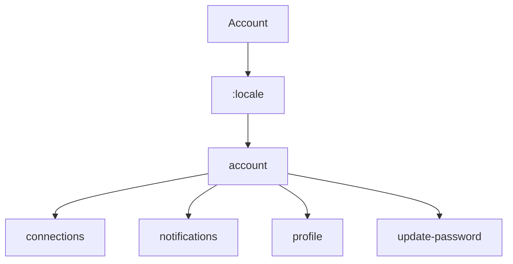

# Account Routes

This section contains 5 routes.

## Route Structure

## All Routes

| Route | Depth |
|-------|-------|
| `/:locale/account` | 2 |
| `/:locale/account/connections` | 3 |
| `/:locale/account/notifications` | 3 |
| `/:locale/account/profile` | 3 |
| `/:locale/account/update-password` | 3 |
