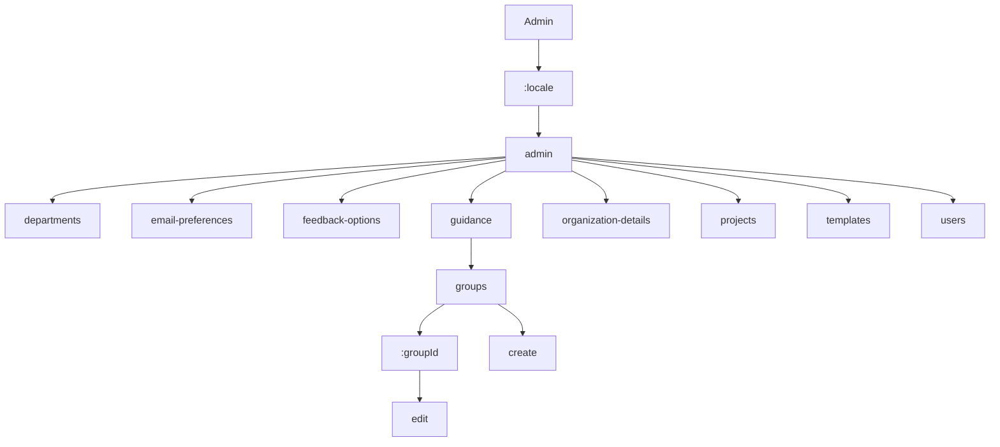

# Admin Routes

This section contains 12 routes.

## Route Structure

## All Routes

| Route | Depth |
|-------|-------|
| `/:locale/admin` | 2 |
| `/:locale/admin/departments` | 3 |
| `/:locale/admin/email-preferences` | 3 |
| `/:locale/admin/feedback-options` | 3 |
| `/:locale/admin/guidance` | 3 |
| `/:locale/admin/guidance/groups/:groupId` | 5 |
| `/:locale/admin/guidance/groups/:groupId/edit` | 6 |
| `/:locale/admin/guidance/groups/create` | 5 |
| `/:locale/admin/organization-details` | 3 |
| `/:locale/admin/projects` | 3 |
| `/:locale/admin/templates` | 3 |
| `/:locale/admin/users` | 3 |
