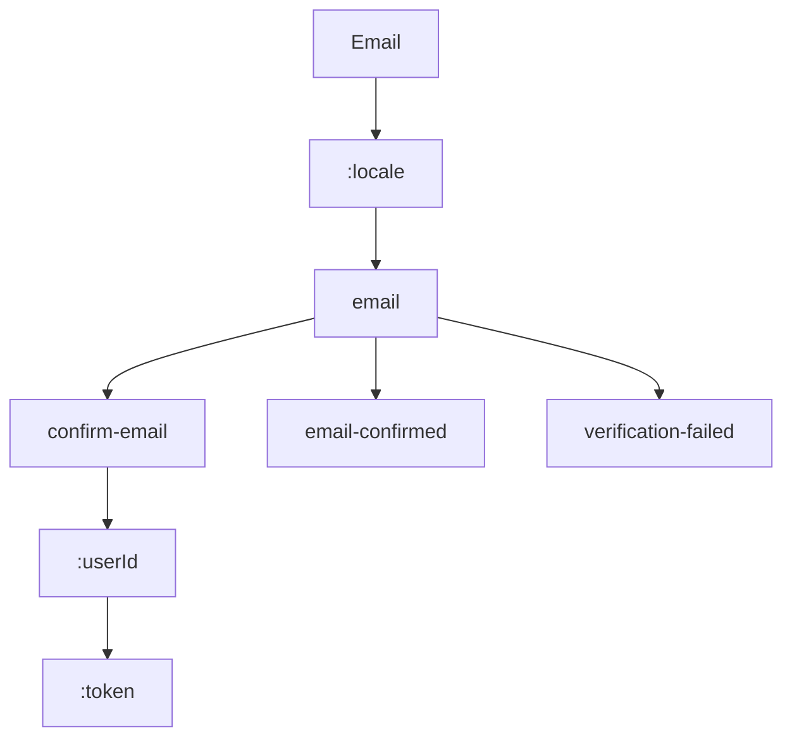

# Email Routes

This section contains 3 routes.

## Route Structure

## All Routes

| Route | Depth |
|-------|-------|
| `/:locale/email/confirm-email/:userId/:token` | 5 |
| `/:locale/email/email-confirmed` | 3 |
| `/:locale/email/verification-failed` | 3 |
