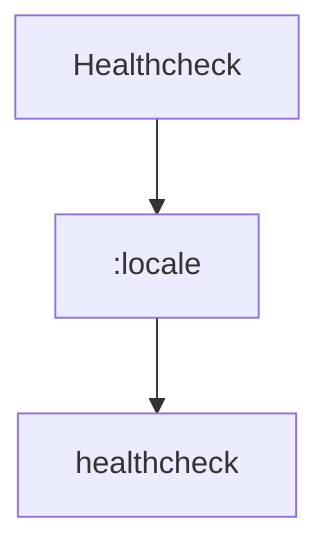

# Healthcheck Routes

This section contains 1 route.

## Route Structure

```mermaid
graph TD
    node0[Healthcheck]
    node1[":locale"]
    node0 --> node1
    node2[healthcheck]
    node1 --> node2
```

## All Routes

| Route | Depth |
|-------|-------|
| `/:locale/healthcheck` | 2 |
