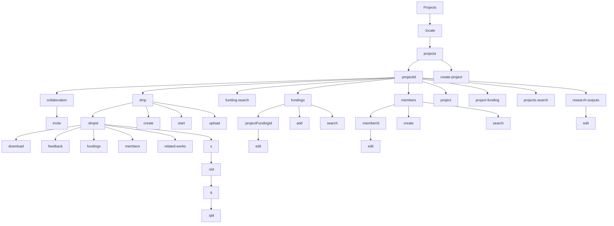

# Projects Routes

This section contains 30 routes.

## Route Structure

## All Routes

| Route | Depth |
|-------|-------|
| `/:locale/projects` | 2 |
| `/:locale/projects/:projectId` | 3 |
| `/:locale/projects/:projectId/collaboration` | 4 |
| `/:locale/projects/:projectId/collaboration/invite` | 5 |
| `/:locale/projects/:projectId/dmp/:dmpid` | 5 |
| `/:locale/projects/:projectId/dmp/:dmpid/download` | 6 |
| `/:locale/projects/:projectId/dmp/:dmpid/feedback` | 6 |
| `/:locale/projects/:projectId/dmp/:dmpid/fundings` | 6 |
| `/:locale/projects/:projectId/dmp/:dmpid/members` | 6 |
| `/:locale/projects/:projectId/dmp/:dmpid/related-works` | 6 |
| `/:locale/projects/:projectId/dmp/:dmpid/s/:sid` | 7 |
| `/:locale/projects/:projectId/dmp/:dmpid/s/:sid/q/:qid` | 9 |
| `/:locale/projects/:projectId/dmp/create` | 5 |
| `/:locale/projects/:projectId/dmp/start` | 5 |
| `/:locale/projects/:projectId/dmp/upload` | 5 |
| `/:locale/projects/:projectId/funding-search` | 4 |
| `/:locale/projects/:projectId/fundings` | 4 |
| `/:locale/projects/:projectId/fundings/:projectFundingId/edit` | 6 |
| `/:locale/projects/:projectId/fundings/add` | 5 |
| `/:locale/projects/:projectId/fundings/search` | 5 |
| `/:locale/projects/:projectId/members` | 4 |
| `/:locale/projects/:projectId/members/:memberId/edit` | 6 |
| `/:locale/projects/:projectId/members/create` | 5 |
| `/:locale/projects/:projectId/members/search` | 5 |
| `/:locale/projects/:projectId/project` | 4 |
| `/:locale/projects/:projectId/project-funding` | 4 |
| `/:locale/projects/:projectId/projects-search` | 4 |
| `/:locale/projects/:projectId/research-outputs` | 4 |
| `/:locale/projects/:projectId/research-outputs/edit` | 5 |
| `/:locale/projects/create-project` | 3 |
