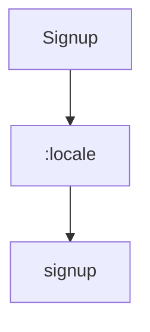

# Signup Routes

This section contains 1 route.

## Route Structure

```mermaid
graph TD
    node0[Signup]
    node1[":locale"]
    node0 --> node1
    node2[signup]
    node1 --> node2
```

## All Routes

| Route | Depth |
|-------|-------|
| `/:locale/signup` | 2 |
