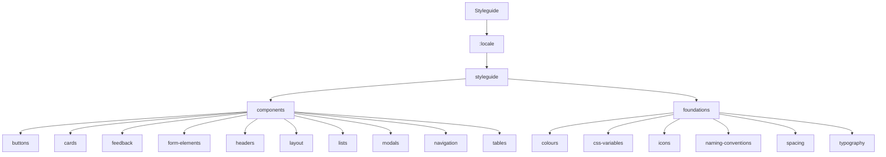

# Styleguide Routes

This section contains 19 routes.

## Route Structure

## All Routes

| Route | Depth |
|-------|-------|
| `/:locale/styleguide` | 2 |
| `/:locale/styleguide/components` | 3 |
| `/:locale/styleguide/components/buttons` | 4 |
| `/:locale/styleguide/components/cards` | 4 |
| `/:locale/styleguide/components/feedback` | 4 |
| `/:locale/styleguide/components/form-elements` | 4 |
| `/:locale/styleguide/components/headers` | 4 |
| `/:locale/styleguide/components/layout` | 4 |
| `/:locale/styleguide/components/lists` | 4 |
| `/:locale/styleguide/components/modals` | 4 |
| `/:locale/styleguide/components/navigation` | 4 |
| `/:locale/styleguide/components/tables` | 4 |
| `/:locale/styleguide/foundations` | 3 |
| `/:locale/styleguide/foundations/colours` | 4 |
| `/:locale/styleguide/foundations/css-variables` | 4 |
| `/:locale/styleguide/foundations/icons` | 4 |
| `/:locale/styleguide/foundations/naming-conventions` | 4 |
| `/:locale/styleguide/foundations/spacing` | 4 |
| `/:locale/styleguide/foundations/typography` | 4 |
