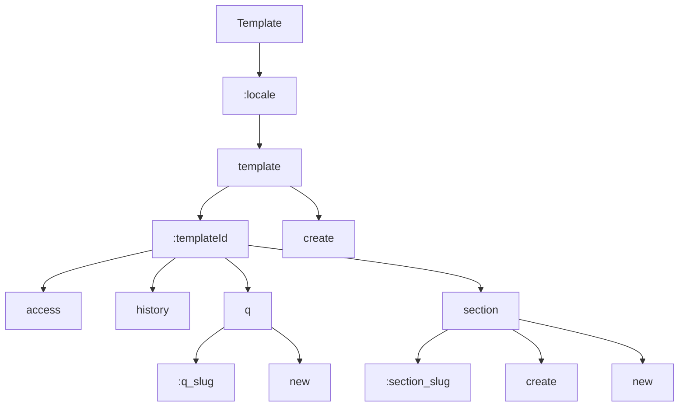

# Template Routes

This section contains 10 routes.

## Route Structure

## All Routes

| Route | Depth |
|-------|-------|
| `/:locale/template` | 2 |
| `/:locale/template/:templateId` | 3 |
| `/:locale/template/:templateId/access` | 4 |
| `/:locale/template/:templateId/history` | 4 |
| `/:locale/template/:templateId/q/:q_slug` | 5 |
| `/:locale/template/:templateId/q/new` | 5 |
| `/:locale/template/:templateId/section/:section_slug` | 5 |
| `/:locale/template/:templateId/section/create` | 5 |
| `/:locale/template/:templateId/section/new` | 5 |
| `/:locale/template/create` | 3 |
