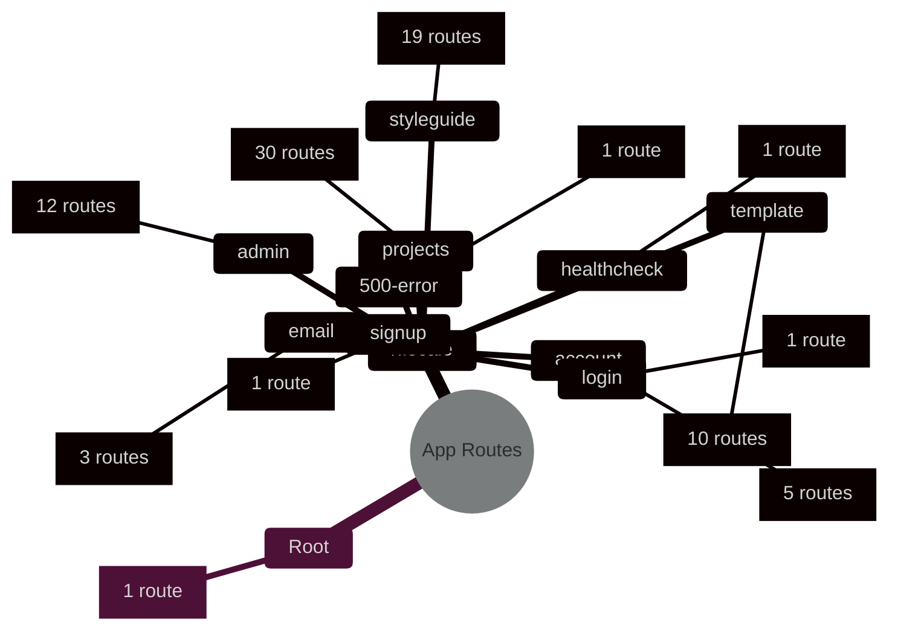

# Application Sitemap

Generated on: 2026-01-15T03:36:25.722Z

Total routes: 84

## Overview

## Route Groups

- **[500-error](./routes/500-error.md)** - 1 route
- **[account](./routes/account.md)** - 5 routes
- **[admin](./routes/admin.md)** - 12 routes
- **[email](./routes/email.md)** - 3 routes
- **[healthcheck](./routes/healthcheck.md)** - 1 route
- **[login](./routes/login.md)** - 1 route
- **[projects](./routes/projects.md)** - 30 routes
- **[signup](./routes/signup.md)** - 1 route
- **[styleguide](./routes/styleguide.md)** - 19 routes
- **[template](./routes/template.md)** - 10 routes
- **[Root Routes](./routes/root.md)** - 1 route

## Quick Reference

View all routes

- `/:locale`
- `/:locale/500-error`
- `/:locale/account`
- `/:locale/account/connections`
- `/:locale/account/notifications`
- `/:locale/account/profile`
- `/:locale/account/update-password`
- `/:locale/admin`
- `/:locale/admin/departments`
- `/:locale/admin/email-preferences`
- `/:locale/admin/feedback-options`
- `/:locale/admin/guidance`
- `/:locale/admin/guidance/groups/:groupId`
- `/:locale/admin/guidance/groups/:groupId/edit`
- `/:locale/admin/guidance/groups/create`
- `/:locale/admin/organization-details`
- `/:locale/admin/projects`
- `/:locale/admin/templates`
- `/:locale/admin/users`
- `/:locale/email/confirm-email/:userId/:token`
- `/:locale/email/email-confirmed`
- `/:locale/email/verification-failed`
- `/:locale/healthcheck`
- `/:locale/login`
- `/:locale/projects`
- `/:locale/projects/:projectId`
- `/:locale/projects/:projectId/collaboration`
- `/:locale/projects/:projectId/collaboration/invite`
- `/:locale/projects/:projectId/dmp/:dmpid`
- `/:locale/projects/:projectId/dmp/:dmpid/download`
- `/:locale/projects/:projectId/dmp/:dmpid/feedback`
- `/:locale/projects/:projectId/dmp/:dmpid/fundings`
- `/:locale/projects/:projectId/dmp/:dmpid/members`
- `/:locale/projects/:projectId/dmp/:dmpid/related-works`
- `/:locale/projects/:projectId/dmp/:dmpid/s/:sid`
- `/:locale/projects/:projectId/dmp/:dmpid/s/:sid/q/:qid`
- `/:locale/projects/:projectId/dmp/create`
- `/:locale/projects/:projectId/dmp/start`
- `/:locale/projects/:projectId/dmp/upload`
- `/:locale/projects/:projectId/funding-search`
- `/:locale/projects/:projectId/fundings`
- `/:locale/projects/:projectId/fundings/:projectFundingId/edit`
- `/:locale/projects/:projectId/fundings/add`
- `/:locale/projects/:projectId/fundings/search`
- `/:locale/projects/:projectId/members`
- `/:locale/projects/:projectId/members/:memberId/edit`
- `/:locale/projects/:projectId/members/create`
- `/:locale/projects/:projectId/members/search`
- `/:locale/projects/:projectId/project`
- `/:locale/projects/:projectId/project-funding`
- `/:locale/projects/:projectId/projects-search`
- `/:locale/projects/:projectId/research-outputs`
- `/:locale/projects/:projectId/research-outputs/edit`
- `/:locale/projects/create-project`
- `/:locale/signup`
- `/:locale/styleguide`
- `/:locale/styleguide/components`
- `/:locale/styleguide/components/buttons`
- `/:locale/styleguide/components/cards`
- `/:locale/styleguide/components/feedback`
- `/:locale/styleguide/components/form-elements`
- `/:locale/styleguide/components/headers`
- `/:locale/styleguide/components/layout`
- `/:locale/styleguide/components/lists`
- `/:locale/styleguide/components/modals`
- `/:locale/styleguide/components/navigation`
- `/:locale/styleguide/components/tables`
- `/:locale/styleguide/foundations`
- `/:locale/styleguide/foundations/colours`
- `/:locale/styleguide/foundations/css-variables`
- `/:locale/styleguide/foundations/icons`
- `/:locale/styleguide/foundations/naming-conventions`
- `/:locale/styleguide/foundations/spacing`
- `/:locale/styleguide/foundations/typography`
- `/:locale/template`
- `/:locale/template/:templateId`
- `/:locale/template/:templateId/access`
- `/:locale/template/:templateId/history`
- `/:locale/template/:templateId/q/:q_slug`
- `/:locale/template/:templateId/q/new`
- `/:locale/template/:templateId/section/:section_slug`
- `/:locale/template/:templateId/section/create`
- `/:locale/template/:templateId/section/new`
- `/:locale/template/create`

